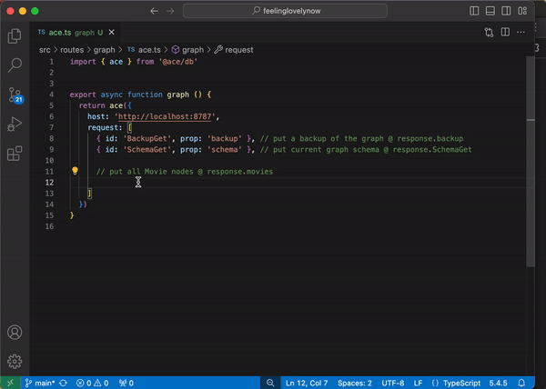

## 🙏 Our Mission
* Create, maintain and enhance the Best database for JavaScript Developers!


## 🔐 Security
1. Ace formats data in [Cloudflare's](https://developers.cloudflare.com/durable-objects/) encrypted key value store as nodes, relationships and props (aka: a graph format)
1. Read, insert, update and delete permissions can be configured for nodes, relationships or props thanks to our `core` plugin

## 🥹 Dynamic
1. Nodes may have props, relationships may have props, and relationships may be one to one, one to many or many to many
1. Our cli can save unencrypted backups locally, save encrypted backups locally and apply any of these backups to your graph for free

## 🙌 Types
1. Based on the JSON Schema you provide, our cli creates types for TypeScript devs and JSDoc comments for JavaScript devs
1. The Ace query language is a typesafe function called `ace()`, that enables expressive queries and transactional mutations


<br/>



## 🎬 Create a Movie Graph 
****Step 1: Bash****
``` bash
pnpm add @ace/db # or npm
ace dev # start local graph
```
****Step 2: JavaScript: One transactional function call to `ace()`****
```ts
import { ace } from '@ace/db'


const response = await ace({
  host: 'http://localhost:8787',
  request: [ // The provided request array order, is the order Ace follows


    // Empty the graph, aka start fresh
    { id: 'Empty' },


    // Add the Actor node, the Movie node and the actsInMovie relationship to the schema
    {
      id: 'SchemaAdd',
      x: { // Intellisense within x changes based on above id
        schema: {
          nodes: {
            Actor: { // Node: Actor
              firstName: { id: 'Prop', x: { dataType: 'string', mustBeDefined: true } },
              lastName: { id: 'Prop', x: { dataType: 'string', mustBeDefined: true } },
              actsIn: { id: 'ForwardRelationshipProp', x: { has: 'many', node: 'Movie', relationship: 'actsInMovie' } },
            },
            Movie: { // Node: Movie
              name: { id: 'Prop', x: { dataType: 'string', mustBeDefined: true } },
              actors: { id: 'ReverseRelationshipProp', x: { has: 'many', node: 'Actor', relationship: 'actsInMovie' } },
            },
          },
          relationships: {
            actsInMovie: { // Relationship: actsInMovie
              id: 'ManyToMany',
              props: {
                // This is a relationship prop (actsInMovie > _salary)
                // When calling ace() with NodeQuery or RelationshipQuery (as seen below), it is helpful for relationship props to start with an underscore
                // Starting relationship props with an underscore helps identify which props are node props (do not start with underscore) and which props are relationship props (start with underscore)
                _salary: { id: 'RelationshipProp', x: { dataType: 'number' } }
              }
            }
          }
        }
      }
    },


    // See how the uid for the NodeInsert is _:Matrix or _:Keanu or _:Laurence or _:Carrie
    // Thanks to enums placed after _: these nodes may be referenced below @ RelationshipInsert
    // Before placing these nodes into the graph, Ace will give these nodes uids AND use the created uids @ RelationshipInsert below
    { id: 'NodeInsert', node: 'Movie', x: { uid: '_:Matrix', name: 'The Matrix' } },
    { id: 'NodeInsert', node: 'Actor', x: { uid: '_:Keanu', firstName: 'Keanu', lastName: 'Reeves' } },
    { id: 'NodeInsert', node: 'Actor', x: { uid: '_:Laurence', firstName: 'Laurence', lastName: 'Fishburne' } },
    { id: 'NodeInsert', node: 'Actor', x: { uid: '_:Carrie', firstName: 'Carrie-Anne', lastName: 'Moss' } },


    // Relationships unite two nodes and may also have props
    // The uid for the first node is a and the uid for the second node is b
    // For the relationship actsInMovie:
      // a is the actor uid b/c schema.nodes.Actor has the ForwardRelationshipProp (Actor.actsIn)
      // b is the movie uid b/c schema.nodes.Movie has the ReverseRelationshipProp (Movie.actors)
    { id: 'RelationshipInsert', relationship: 'actsInMovie', x: { a: '_:Keanu', b: '_:Matrix', _salary: 9001 } },
    { id: 'RelationshipInsert', relationship: 'actsInMovie', x: { a: '_:Carrie', b: '_:Matrix', _salary: 720 } },
    { id: 'RelationshipInsert', relationship: 'actsInMovie', x: { a: '_:Laurence', b: '_:Matrix', _salary: 369 } },


    // IF a uid is not specified for NodeInsert as seen below
      // Ace creates a uid for this node before placing the node into the graph AND this node can't be used in relationships for this ace() call like we do above
    // IF a uid is set (crypto.randomUUID()) for a node
      // Ace won't create a uid before placing the node into the graph AND this node can be used in relationships for this ace() call by using the uid in relationships
    { id: 'NodeInsert', node: 'Movie', x: { name: 'Avatar' } },


    // Put a backup of the graph @ response.backup (includes data added above)
    { id: 'BackupGet', prop: 'backup' },


    // put the current graph schema @ response.schema (includes above schema)
    { id: 'SchemaGet', prop: 'schema' },


    // Put all Actor nodes @ response.actors: { actors: [ { uid: 'abc', firstName: 'Keanu', lastName: 'Reeves' }, ... ] }
    { id: 'NodeQuery', node: 'Actor', prop: 'actors' },


    // Put all Movie nodes @ response.movies: { movies: [ { name: 'Avatar' }, { name: 'The Matrix', actors: [ ... ] } ] }
    {
      id: 'NodeQuery',
      node: 'Movie',
      prop: 'movies',
      x: { // If x is not defined like the Actor NodeQuery above, all none relationship props (uid, firstName, lastName) will be in the response. If x is defined as we see here, only the requested props in x will be in the response. Intellisense w/in x changes based on the id and node thanks to generated types based on your schema
        uid: true,
        name: true,
        actors: {
          _salary: true, // relationship props, as defined above in the schema, start with an underscore and you can see why in the queries it's helpful to start relationship props with an underscore
          firstName: true,
          lastName: true,
        }
      }
    },


    // Querying by node or by relationship is possible: { actsInMovie: [ { _uid: 'abc', _salary: 9001, actors: { firstName: 'Keanu', ... }, actsIn: { name: 'The Matrix', ... } } ] }
    {
      id: 'RelationshipQuery',
      relationship: 'actsInMovie',
      prop: 'actsInMovie',
      x: {
        _uid: true, // actsInMovie relationship prop
        _salary: true, // actsInMovie relationship prop
        actors: true, // Actor node prop. So this will be the actor of the relationship. And b/c we put true here all the Actor none relationship props (uid, firstName, lastName) will be in the response
        actsIn: true, // Movie node prop. So this will be the movie of the relationship. And b/c we put true here all the Movie none relationship props (uid, name) will be in the response
      }
    },


    // Find the Keanu + Matrix Relationship --- { keanuMatrixRelationship: { _uid: 'abc', _salary: 9001, star: { firstName: 'Keanu' }, actsIn: { name: 'The Matrix' } } }
    {
      id: 'RelationshipQuery',
      relationship: 'actsInMovie',
      prop: 'keanuMatrixRelationship',
      x: {
        $o: { // $o is where we may put options for this section of the query
          // B/c we are doing a find (findByPropValue), response.keanuMatrixRelationship will be an object rather then an array
          // Notice how actors has an alias of star and we use the alias prop in the relationships array
          // findByPropValue basically means the left side of the operator is a Prop and the right side is a Value
          // As seen in the next query, many more operators, filters and find options are available
          // We can write enums like _:Keanu if the enum is defined in this ace() call or we can write the actual value we are looking for
          findByPropValue: [ { relationships: [ 'star' ], prop: 'uid' }, 'equals', '_:Keanu' ]
        },
        actsIn: true,
        actors: {
          $o: { alias: 'star' }, // response.keanuMatrixRelationship.star rather then response.keanuMatrixRelationship.actors
          firstName: true,
        },
      }
    },


    // Filters return an array & find returns an object
    // findByOr, findByAnd, filterByOr & filterByAnd are all available
    {
      id: 'RelationshipQuery',
      relationship: 'actsInMovie',
      prop: 'filter',
      x: {
        $o: {
          filterByOr: [ // responds w/ actors that match any criteria
            [ { prop: '_salary' }, 'greaterThan', 9000 ], // even though _salary is not be in the response we can filter by it
            [ { relationships: [ 'star' ], prop: 'firstName' }, 'doesNotEqual', 'Carrie-Anne' ], // relationships array uses the alias (star not actors)
          ]
        },
        actsIn: true,
        actors: { $o: { alias: 'star' } },
      }
    },


    // NodeQuery --- { matrix: { uid: 'abc', name: 'The Matrix', actors: [ ... ] } }
    {
      id: 'NodeQuery',
      node: 'Movie',
      prop: 'matrix',
      x: {
        $o: {
          // Without this find, an array of all movies will be in the response.
          // With this find, only the matrix object will be @ response.matrix
          findByUid: '_:Matrix'
        },
        uid: true,
        name: true,
        actors: { // Since no props are defined w/in actors, all none relationship Actor props (uid, firstName, lastName) and the new props (fullName, bonus) will be in the response
          $o: {
            sort: { prop: '_salary', how: 'dsc' }, // sort actors by salary
            limit: { skip: 1, count: 2 }, // skip the first actor then show the next 2
            flow: [ 'sort', 'limit', 'newProps' ], // do options in this order
            newProps: { // add these props to each actor
              fullName: { add: [ { prop: 'firstName' }, ' ',  { prop: 'lastName' } ] },
              bonus: { // (Salary / 12) + 1000
                add: [
                  { divide: [ { prop: '_salary' }, 12 ] },
                  1000,
                ]
              },
            }
          },
        }
      }
    },
  ]
})
```
****Step 3: Bash****
``` bash
ace types -h=http://localhost:8787 #generate types that align with the above schema for intellisense
```


## 🧚‍♀️ CLI
* Clone this repo or pull `@ace/db` from npm to get access to our cli
* To show everything our cli can do, asking our cli for help... is helpful 🥁
* To do this, in bash just enter, `ace`, `ace -h`, `ace --help` or `ace help` and this is what shows up:
```bash
Ace Graph Database CLI v${ version }


ace
  Shows this message
  Options:
    -h      |  Optional  |  ace -h
    help    |  Optional  |  ace help
    --help  |  Optional  |  ace --help


ace version
   Prints your currently downloaded Ace Graph Database Version


ace jwks
  Creates 1 public jwk and 1 private jwk (that may be used together) and logs the jwks to the console
  Why: Send jwks to ace() whenever you would love to do cryptography
  JWKs:
    - JSON Web Keys
    - Cryptography keys
    - Like a password
      - A private jwk can encrypt and decrypt data
      - A private jwk can create a hash while a public jwk can validate a hash
      - We recomend storing jwks in your .env file


ace dev
  Start a local Ace Graph Database (Cloudflare Worker + Cloudflare Durable Object)


ace schemaToFile
  Get most recent schema from graph and then save schema to a file locally
  Location File: [ Current Directory ]/ace/schemas/[ File Name ].json
  File Name Default: Now Iso Datetime
  Options:
    -h      |  Host       |  Required  |  String
    --host  |  Host       |  Required  |  String
    -n      |  File Name  |  Optional  |  String
    --name  |  File Name  |  Optional  |  String
  Examples:
    ace schemaToFile -h=http://localhost:8787
    ace schemaToFile --host=http://localhost:8787
    ace schemaToFile -h=http://localhost:8787 -n=qa
    ace schemaToFile --host=http://localhost:8787 --name=dev


ace graphToFile
  Generate backup and then save backup to a file locally
  Location File: [ Current Directory ]/ace/backups/[ File Name ].json
  File Name Default: Now Iso Datetime
  Crypt JWK: If a \`Crypt JWK\` is provided, the backup will be encrypted
  Options:
    -h      |  Host       |  Required  |  String
    --host  |  Host       |  Required  |  String
    -n      |  File Name  |  Optional  |  String
    --name  |  File Name  |  Optional  |  String
    -j      |  Crypt JWK  |  Optional  |  String
    --jwk   |  Crypt JWK  |  Optional  |  String
  Examples:
    ace graphToFile -h=http://localhost:8787
    ace graphToFile --host=http://localhost:8787
    ace graphToFile -h=http://localhost:8787 -n=qa
    ace graphToFile --host=http://localhost:8787 --name=qa
    ace graphToFile -h=http://localhost:8787 -j='{ ... }'
    ace graphToFile --host=http://localhost:8787 --jwk='{ ... }'


ace fileToGraph
  Read backup from file and then save backup to graph
  File Location: [ Current Directory ]/ace/backups/[ File ]
  Crypt JWK: If a \`Crypt JWK\` is provided, the backup will be decrypted
  Skip Data Delete: When a backup is applied with "ace fileToGraph" an entire graph delete is done first, to avoid the delete and just apply the backup use this option
  Options:
    -f                |  File              |  Required  |  String
    -file             |  File              |  Required  |  String
    -h                |  Host              |  Required  |  String
    --host            |  Host              |  Required  |  String
    -j                |  Crypt JWK         |  Optional  |  String
    --jwk             |  Crypt JWK         |  Optional  |  String
    -s                |  Skip Data Delete  |  Optional  |  Boolean
    --skipDataDelete  |  Skip Data Delete  |  Optional  |  Boolean
  Examples:
    ace fileToGraph -f=qa.json -h=http://localhost:8787
    ace fileToGraph --file=qa.json --host=http://localhost:8787
    ace fileToGraph -f=qa.json -h=http://localhost:8787 -j='{ ... }'
    ace fileToGraph --file=qa.json --host=http://localhost:8787 --jwk='{ ... }'
    ace fileToGraph -f=backup.json -h=http://localhost:8787 -s=true
    ace fileToGraph --file=2024-03-24T19:44:36.492Z.json --host=http://localhost:8787 --skipDataDelete=true


ace types
  Create types (TS) and typedefs (JSDoc)
    - IF a host (Cloudflare Worker URL) is provided
      - Types take into consideration this hosted schema
    - ELSE IF a (schema) file is provided [ Current Directory ]/ace/schemas/
      - Types take into consideration this file schema
    - ELSE
      - Types do not take into consideration any schema
  Options:
    -h      |  Host  |  Optional  |  String
    --host  |  Host  |  Optional  |  String
    -f      |  File  |  Optional  |  String
    --file  |  File  |  Optional  |  String
  Examples:
    ace types -h=http://localhost:8787
    ace types --host=http://localhost:8787
    ace types -f=qa.json
    ace types --file=2024-03-24T19:44:36.492Z.json
```


## 🕰️ Origin Story
1. Java SQL Strings
1. PHP SQL Strings
1. Node SQL Strings
1. Mongoose
1. Dgraph
1. Prisma
1. Drizzle
1. Cloudflare Durable Objects
1. Ace


## 🙋‍♀️ Why was Ace created?
1. Graph = Natural Data Storage
    * Nodes = Neurons
    * Relationships = Synapses
1. Example:
    * To remember Mom's Yoga Studio, I do not join All Users and All Yoga Studio's in my mind
    * Instead I just walk the graph, from one node to the next, just like Ace
1. So graphs resemble how we naturally store data but before Ace, no graph database offered lovely intellisense like Prisma or Drizzle
    * So this is the hole in the market we fill
    * Ace unites a Graph Database with JavaScript Intellisense!


## ⚡️ Performance
* Goodbye joins and greetings `maps`, aka node and relationship queries are [O(1)](https://stackoverflow.com/questions/697918/what-does-o1-access-time-mean)
    * For example, If a users uid is `abc` and you'd love to get all that users friends, Ace will:
        1. `O(1)` lookup the users node `map.get('abc')`
        1. Find the the index of friend uids in the value for that node, `friends: [ 'xyz', '123' ]`
        1. `O(1)` lookup each friend `map.get([ 'xyz', '123' ])` from [Cloudflare's](https://developers.cloudflare.com/durable-objects/) key value store (aka: a Map)
    * JavaScript is not the fastest language, but for something this simple, (`map.put()` & `map.get()`), it’s a lovely v1 language
    * By [v3](#-version-3-roadmap) we plan on providing Universal (Self) Hosting and Ace Cloud Hosting options thanks to a low level language rewrite (maybe w/ [Zig](https://ziglang.org/) 1.x) that'll compile to a binary and can be hosted anywhere! 😀


## 📀 Storage Options
1. Cloudflare Durable Object
    * Version 1
    * Their $5 a month pricing tier allows:
        * [50 GB of Storage](https://developers.cloudflare.com/durable-objects/platform/limits/)
        * [1 million monthly requests](https://developers.cloudflare.com/durable-objects/platform/pricing/)
        * [Encryption @ Rest](https://developers.cloudflare.com/durable-objects/reference/data-security/)
1. Universal (Self) Hosting
    * Version 3
1. Ace Cloud Hosting
    * Version 3


## 🤓 Version 1 Roadmap
1. Validations
    * Schema
        * Node and Prop name must not have a space in them
    * ace()
        * A prop of `$ace` is not allowed
1. Cloudflare allows a `storage.get()` of up to [128](https://developers.cloudflare.com/durable-objects/api/transactional-storage-api/#get) keys at a time 
    * Create `./src/lib/ace/storage/get()`
    * If key count is > 120 => do the `storage.get()` in batches of 120 then concat the results
1. $o
    * `random`
    * `newProps` (support based on response)
1. `ace()`
    * Response Types
    * Sanitize / Validate Input 
    * Graphs support 
    * Complete idsAce
1. Relationship prop indexes
    * Sort Index
    * Unique Index
1. Full Text Index
    * Node Prop
    * Relationship Prop
1. Schema default values
    * If value is `now` and dataType is `isoString` rather then default to string now, default to the current timestamp
1. Runtime validation
    * v1
      * Accepts: a test object + (a schema node / a schema relationship) 
      * Responds: does the test object obey the schema
    * v2
      * Also accepts options to add validations, edit validations or remove validations
1. Comments (param, returns, description, example usage, why, proofread) for all index functions
1. Create a GDPR Compliant Ecommerce Store w/ Ace
    * Real project (example / benchmarks)
    * Ecomm store w/ EU Customer Data Stored in an EU Durable Object
1. App Worker > Ace Durable Object
1. Schema Migrations
    * Every schema node relationship and prop has a uid
        * This way when we are compaing schemas we can know how the schema has been updated
    * `ace migrationToFile`
        * recieve devSchema & mainSchema
        * Create a plugin, install gets us from one schema to the next, uninstall gets us from prod schema to dev schema
        * Save plugin to the ace/migrations
        * Optional options
            * File Name (Default now timestamp)
            * JWK (To Encrypt the plugin)
    * `ace applyMigration`
        * Run migration plugin install @ host
    * `ace revertMigration`
        * Run migration plugin uninstall @ host
1. 2FA + Authy Support
1. Studio
    * (View / Edit) data from multiple graphs, simultaneously, locally in the browser
1. Logs
    * Why?
    * What?
    * Where?
    * Write ahead logs?
1. On Error Flow (error categories?)
    * Retry: Count, MS Before Trying Again
    * Log to KV
    * Backup to KV
    * Email Log
    * Email Backup
    * Provide `ace()`, `request`  for how to get graph back to how it was before this error
        * Offline support > Response Allows Resume
1. Simulator
    * Speed up time to test things that take time
    * Replay
    * Loop
    * Auto Create GitHub Bug
1. Independant Security Audit
1. Independant Code Review
1. Unit Tests
    * Fuzz tests
    * Boundary value tests
    * Regression tests
    * Operating system crashes
    * Power loss
    * I/O Errors
    * Out of memory errors
1. Docs
    * Data Types
    * Hash w/o Salt Example
    * Hash w/ Salt Example
    * Prerequisites: First time Cloud deploy 
    * Prerequisites: Updating Cloud Graph
    * Search
    * Link to see / edit on GitHub
    * Forum
1. Ace Database Foundation
    * Mission Statement
        * Create, maintain and enhance the Best Database for JavaScript Developers!
    * Principles
        * Open Governance
        * Community Driven
        * Welcome to all users and contributors
    * Council will be those that:
        * Align with the majority of our roadmap
        * Have ideas for how to improve our roadmap
        * Hope to be in this adventure together


## 🌟 Version 2 Roadmap 
1. Community Ideas
1. GitHub Issues
1. Foundation Ideas
1. X > `ace()` > Cloudflare Worker > Cloudflare Durable Object
    * Bun Server
    * Deno Server
    * Deno Edge
    * Vercel Edge
1. Query Planner
1. Optimize Queries
1. KV (request cache) Integration
1. Webhooks
1. Studio
    * Website (Not just local anymore) (sign in) (make data adjustments anywhere)
    * Report Builder
    * Report Scheduler
    * Q&A - Show questions that makes sense to ask about the graph and the answers
    * Analytics
1. Backup triggers (replica / sync graph)
1. On Error Flow
    * Slack
    * Custom
1. Geojson support
    * Coordinates data type (Multidimensional array with longitude and latitude array)
1. Timeseries data types
1. Docs
    * Explain Version 2
    * Ask Ai


## ✨ Version 3 Roadmap 
1. Community Ideas
1. GitHub Issues
1. Foundation Ideas
1. Univesal (Self) Hosting Ability
    * Durable Object functionality compiled to binary, built w/ Zig 1.x (of stable Zig)
        * Http Server
        * Store Key Value Data @ Memory
        * Store Key Value Data @ Disk
        * Encryption @ Rest via user provided jwk or Ace will create one
        * Build Input / Output Gates
        * Optimize Queries & Sorting
        * Pass all JS Unit Tests
        * Create Zig Unit Tests
    * Call `ace()` Zig code from the following servers + edge environments:
        * Worker
        * Node
        * Deno
        * Bun
        * Vercel
        * AWS
        * Zig
1. REPL (event, storage, share)
    1. WASM (Zig DB In Browser)
1. Vector Data Type
1. VMWare Private Ai
    * Teach Ai w/ data from graph(s)
    * Ask Ai questions about graph(s)
1. Rag support
1. Ace Cloud v1.0
    * via Ace Graph Database Foundation
    * Clean + Simple + Performant UX
    * Deploy / Monitor / Maintain graphs:
      * Options:
          * Cloudflare Storage
          * Ace Cloud Storage
          * Universal (Self) Storage
      * Simple hosting provider migration
      * Simple hosting provider cost breakdowns
          * Real time cost comparisons
      * Components added to Studio just for Cloud customers
          * Monitoring
          * Backups
          * Custom (Analytics / Alerts) via (Component / Email / Webhook / Slack)
          * Collaboration
      * Support
          * Blog
          * Forum
          * StackOverflow
          * Email
          * Chat
          * Phone
1. Ace Studio
    * (Desktop / Android / Mobile) Applications 
        * Data Alerts (Notifications)
    * Ai chart generation
    * Ai Q&A generator
    * Collaboration Tools


## ✅ Version Update Plan
1. 0.0.x (Prototype) to 0.1.0 (Beta)
    * When all 1.0 road map items are in testing
    * Will not include a migration script
1. 0.x.0 to 1.0
    * When all 1.0 road map items pass testing and we've created:
        * A GDPR compliant Ecommerce Store w/ Ace
        * Ace Studio
        * Docs Site
        * Forum
        * The Ace Database Foundation
    * Will not include a migration script
1. 1.x to 2.0
    * When all 2.0 road map items pass testing
    * Will include a 1.x to 2.0 migration script
1. 2.x to 3.0
    * When all 3.0 road map items pass testing and Ace Cloud v1.0 is achieved
    * Will include a 2.x to 3.0 migration script


## 🌎 Call `ace()` with cURL
* The Ace query language with cURL, is the same as above in `JS/TS`
* Thanks to `ace types`, above is easier, thanks to intellisense
* To format the JSON response, `npm i -g json` and then @ the end of a cURL add ` | json`
``` bash
curl --header "Content-Type: application/json" \
  --request POST \
  --data '{
    "request": [
      { "id": "NodeInsert", "node": "Movie",  "x": { "name": "Hercules" } },
      { "id": "NodeQuery",  "node": "Movie", "prop": "movies" },
      { "id": "RelationshipQuery",  "relationship": "actsInMovie", "prop": "actsInMovie" },
    ]
  }' \
  http://localhost:8787/ace
```
