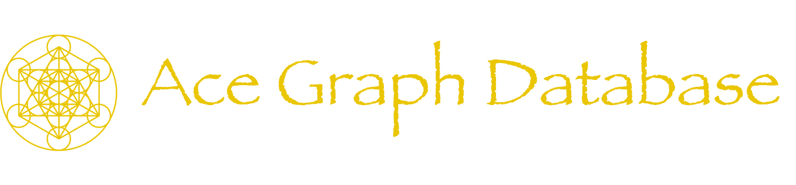

## 🙏 Our Mission
* Create, maintain and enhance the Best database for JavaScript Developers!


## 🤔 Ace Description
1. Secure: Ace formats data in [Cloudflare's](https://developers.cloudflare.com/durable-objects/) encrypted key value store as nodes, relationships and props (aka: graph format)
1. Dynamic: Nodes may have props, relationships may have props, and relationships may be one to one, one to many or many to many
1. Typesafe: Based on the JSON Schema you provide, our cli can create types for TypeScript devs and JSDoc comments for JavaScript devs


## 🙋‍♀️ Queries, Mutations and Data Management
1. Simple: The Ace query language is a typesafe function called `ace()`, that enables expressive queries and transactional mutations
1. Permissions: Read, insert, upsert, update and delete permissions can be configured for nodes, relationships or properties thanks to our `core` plugin
1. Free Backups: Our cli can save zipped and encrypted backups locally for free, apply backups to a graph or save backups to [Cloudflare](https://www.cloudflare.com/developer-platform/r2/)


## ⚡️ Performance
1. Fast: Both node and relationship queries are [O(1)](https://stackoverflow.com/questions/697918/what-does-o1-access-time-mean)
1. Map: To query a `Users > Friends`, Ace will O(1) lookup the index of `Friend uids` from [Cloudflare's](https://developers.cloudflare.com/durable-objects/) key value store (aka: a Map)
1. Goodbye Joins: JavaScript is not the fastest language, but for something this simple, (`map.put()` & `map.get()`), it’s a lovely v1 language
    * By [v3](#-version-3-roadmap) we plan on providing Universal Hosting and Ace Cloud Hosting options thanks to a low level language (maybe w/ [Zig](https://ziglang.org/) 1.x) rewrite


## 🎬 Create a Movie Graph 
****Step 1: Bash****
``` bash
pnpm add @ace/db # or npm
ace dev # start local graph
```
****Step 2: JavaScript: One transactional function call to `ace()`****
```ts
import { ace } from '@ace/db'


const response = await ace({
  host: 'http://localhost:8787',
  request: [


    // add the Actor node, the Movie node and the actsInMovie relationship to the schema
    {
      id: 'AddToSchema',
      x: { // intellisense within x changes based on above id
        schema: {
          nodes: {
            Actor: { // Node: Actor
              firstName: { id: 'Prop', x: { dataType: 'string', mustBeDefined: true } },
              lastName: { id: 'Prop', x: { dataType: 'string', mustBeDefined: true } },
              actsIn: { id: 'ForwardRelationshipProp', x: { has: 'many', node: 'Movie', relationship: 'actsInMovie' } },
            },
            Movie: { // Node: Movie
              name: { id: 'Prop', x: { dataType: 'string', mustBeDefined: true } },
              actors: { id: 'ReverseRelationshipProp', x: { has: 'many', node: 'Actor', relationship: 'actsInMovie' } },
            },
          },
          relationships: {
            actsInMovie: { // Relationship: actsInMovie
              id: 'ManyToMany',
              props: {
                _salary: { id: 'RelationshipProp', x: { dataType: 'number' } } // This is a relationship prop (actsInMovie > _salary). When calling ace() with QueryByNode or QueryByRelationship, it is helpful for relationship props to start with an underscore. Starting relationship props with an underscore helps identify which props are node props (do not start with underscore) and which props are relationship props (start with underscore)
              }
            }
          }
        }
      }
    },


    // See how the uid for the AddNodeToGraph is _:Matrix --- Thanks to enums placed after _: these nodes may be referenced lower @ AddRelationshipToGraph
    { id: 'AddNodeToGraph', node: 'Movie', x: { uid: '_:Matrix', name: 'The Matrix' } },
    { id: 'AddNodeToGraph', node: 'Actor', x: { uid: '_:Keanu', firstName: 'Keanu', lastName: 'Reeves' } },
    { id: 'AddNodeToGraph', node: 'Actor', x: { uid: '_:Laurence', firstName: 'Laurence', lastName: 'Fishburne' } },
    { id: 'AddNodeToGraph', node: 'Actor', x: { uid: '_:Carrie', firstName: 'Carrie-Anne', lastName: 'Moss' } },


    // a is the actor b/c schema.nodes.Actor has the ForwardRelationshipProp (Actor.actsIn)
    // b is the movie b/c schema.nodes.Movie has the ReverseRelationshipProp (Movie.actors)
    { id: 'AddRelationshipToGraph', relationship: 'actsInMovie', x: { a: '_:Keanu', b: '_:Matrix', _salary: 9001 } },
    { id: 'AddRelationshipToGraph', relationship: 'actsInMovie', x: { a: '_:Carrie', b: '_:Matrix', _salary: 420 } },
    { id: 'AddRelationshipToGraph', relationship: 'actsInMovie', x: { a: '_:Laurence', b: '_:Matrix', _salary: 369 } },


    // IF a uid is not specified for AddNodeToGraph as seen below THEN Ace creates one before placing the node into storage AND this node can't be used in relationships for this ace() call like we do above
    // IF a uid is set (crypto.randomUUID()) THEN Ace won't create a uid before placing the node into storage AND this node can be used in relationships for this ace() call by using the uid in relationships
    { id: 'AddNodeToGraph', node: 'Movie', x: { name: 'Avatar' } },


    // put a backup of the graph @ response.backup (includes data added above)
    { id: 'GetBackup', prop: 'backup' },


    // put the current graph schema @ response.schema (includes above schema)
    { id: 'GetSchema', prop: 'schema' },


    // QueryByNode --- In SQL this would be: SELECT * FROM Actor --- { actors: [ { uid: 'abc', firstName: 'Keanu', lastName: 'Reeves' }, ... ] }
    { id: 'QueryByNode', node: 'Actor', prop: 'actors' },


    // QueryByRelationship --- Querying by node or by relationship is possible --- { actsInMovie: [ { _uid: 'abc', _salary: 9001, star: { firstName: 'Keanu' }, actsIn: { name: 'The Matrix', ... } } ] }
    {
      id: 'QueryByRelationship',
      relationship: 'actsInMovie',
      prop: 'actsInMovie',
      x: {
        _uid: true, // actsInMovie relationship prop: _uid will be in the response
        _salary: true, // actsInMovie relationship prop: _salary will be in the response
        actsIn: true, // Actor.actsIn node prop: b/c no props are specified like in the QueryByNode above, all none relationship props for the Movie node (uid, name) will be in the response
        actors: { // Movie.actors node prop
          $o: { alias: 'star' }, // rather then actors, show star in the response
          firstName: true, // only show the Actor's firstName
        },
      }
    },


    // QueryByRelationship --- { keanuMatrixRelationship: { _uid: 'abc', _salary: 9001, actor: { firstName: 'Keanu' }, actsIn: { uid: '123' name: 'The Matrix' } } }
    {
      id: 'QueryByRelationship',
      relationship: 'actsInMovie',
      prop: 'keanuMatrixRelationship',
      x: {
        $o: {
          all: true, // place none relationship actsInMovie props into the response, so _uid and _salary
          findByPropValue: [ { relationships: ['actors'], prop: 'uid' }, 'equals', '_:Keanu' ] // b/c we are doing a find, the response will be an object rather then an array, only the relationship that has an actor with Keanu's uid will be in the response
        },
        actors: true, // all none relationship Actor props will be in the response (uid, firstName, lastName)
        actsIn: true, // all none relationship Movie props will be in the response (uid, name)
      }
    },


    // QueryByNode --- { matrix: { uid: 'abc', name: 'The Matrix', actors: [ ... ] } }
    {
      id: 'QueryByNode',
      node: 'Movie',
      prop: 'matrix',
      x: { // intellisense below changes based on id and node above, if x is not defined, all nodes and all their none relationship props will be in the response
        $o: {
          findByUid: '_:Matrix' // option: response.matrix will only have the matrix object b/c this option is set, without this find, an array of all movies would be in the response
        },
        uid: true, // put uid into the response @ response.matrix.uid
        name: true,
        actors: {
          $o: {
            filterByPropValue: [ { prop: 'firstName' }, 'doesNotEqual', 'Laurence' ], // respond with actors other then Lauence, filterByPropProp is also available where the 2nd index of this array is a prop
            sort: { prop: 'salary', how: 'dsc' }, // sort actors by salary
            limit: { count: 2, skip: 1 }, // skip the first actor then show the next 2
            flow: [ 'filterByPropValue', 'sort', 'limit', 'newProps' ], // do options in this order
            newProps: {
              bonus: { // add bonus prop to each actor
                multiply: [
                  0.7,
                  { divide: [ { prop: 'salary' }, 12 ] }
                ]
              },
              fullName: { add: [ { prop: 'firstName' }, ' ',  { prop: 'lastName' } ] }, // add fullName prop to each actor
            }
          },
          uid: true, // put Actor.uid into response @ response.matrix.actors[i].uid
          _uid: true, // put actsInMovie._uid into response @ response.matrix.actors[i]._uid
          _salary: { alias: 'salary' }, // put actsInMovie._salary into response @ response.matrix.actors[i].salary
        }
      }
    },


    // QueryByRelationship --- { actsInMovie: { _uid: 'abc', _salary: 9001, star: { ... }, movie: { ... } }
    {
      id: 'QueryByRelationship',
      relationship: 'actsInMovie',
      prop: 'actsInMovie',
      x: {
        $o: {
          all: true, // response.actsInMovie will have all not relationship props (_uid, _salary)
          findByAnd: [ // return the first actor that fulfils both criteria
            [ { prop: '_salary' }, 'greaterThan', 90 ],
            [ { prop: 'name' }, 'doesNotEqual', 'Carrie-Anne Moss' ],
          ]
        },
        actors: {
          $o: { alias: 'star', all: true }, // option: response.actsInMovie[i].star rather then response.actsInMovie[i].actors
        },
        actsIn: {
          $o: { alias: 'movie', all: true }, // option: response.actsInMovie[i].movie rather then response.actsInMovie[i].actsIn
        }
      }
    }
  ]
})
```
****Step 3: Bash****
``` bash
ace types -h=http://localhost:8787 #generate types that align with the above schema for intellisense
```


## 🧚‍♀️ CLI
* Clone this repo or pull `@ace/db` from npm to get access to our cli
* To show everything our cli can do, asking our cli for help... is helpful 🥁
* To do this, in bash just enter, `ace`, `ace -h`, `ace --help` or `ace help` and this is what shows up:
```bash
Ace Graph Database CLI v${ version }


ace
  Shows this message
  Options:
    -h      |  Optional  |  ace -h
    help    |  Optional  |  ace help
    --help  |  Optional  |  ace --help


ace version
   Prints your currently downloaded Ace Graph Database Version


ace jwks
  Creates 1 public jwk and 1 private jwk (that may be used together) and logs the jwks to the console
  Why: Send jwks to ace() whenever you would love to do cryptography
  JWKs:
    - JSON Web Keys
    - Cryptography keys
    - Like a password
      - A private jwk can encrypt and decrypt data
      - A private jwk can create a hash while a public jwk can validate a hash
      - We recomend storing jwks in your .env file


ace dev
  Start a local Ace Graph Database (Cloudflare Worker + Cloudflare Durable Object)


ace schemaToFile
  Get most recent schema from graph and then save schema to a file locally
  Location File: [ Current Directory ]/ace/schemas/[ File Name ].json
  File Name Default: Now Iso Datetime
  Options:
    -h      |  Host       |  Required  |  String
    --host  |  Host       |  Required  |  String
    -n      |  File Name  |  Optional  |  String
    --name  |  File Name  |  Optional  |  String
  Examples:
    ace schemaToFile -h=http://localhost:8787
    ace schemaToFile --host=http://localhost:8787
    ace schemaToFile -h=http://localhost:8787 -n=qa
    ace schemaToFile --host=http://localhost:8787 --name=dev


ace graphToFile
  Generate backup and then save backup to a file locally
  Location File: [ Current Directory ]/ace/backups/[ File Name ].json
  File Name Default: Now Iso Datetime
  Options:
    -h      |  Host       |  Required  |  String
    --host  |  Host       |  Required  |  String
    -n      |  File Name  |  Optional  |  String
    --name  |  File Name  |  Optional  |  String
  Examples:
    ace graphToFile -h=http://localhost:8787
    ace graphToFile --host=http://localhost:8787
    ace graphToFile -h=http://localhost:8787 -n=qa
    ace graphToFile --host=http://localhost:8787 --name=dev


ace fileToGraph
  Read backup from file and then save backup to graph
  File Location: [ Current Directory ]/ace/backups/[ File ]
  Skip Data Delete: When a backup is applied with "ace fileToGraph" an entire graph delete is done first, to avoid the delete and just apply the backup use this option
  Options:
    -f                |  File              |  Required  |  String
    -file             |  File              |  Required  |  String
    -h                |  Host              |  Required  |  String
    --host            |  Host              |  Required  |  String
    -s                |  Skip Data Delete  |  Optional  |  Boolean
    --skipDataDelete  |  Skip Data Delete  |  Optional  |  Boolean
  Examples:
    ace fileToGraph -f=qa.json -h=http://localhost:8787
    ace fileToGraph --file=dev.json --host=http://localhost:8787
    ace fileToGraph -f=backup.json -h=http://localhost:8787 -s=true
    ace fileToGraph --file=2024-03-24T19:44:36.492Z.json --host=http://localhost:8787 --skipDataDelete=true


ace types
  Create types (TS) and typedefs (JSDoc)
    - IF a host (Cloudflare Worker URL) is provided
      - Types take into consideration your schema by requesting it via the host
    - ELSE IF a (schema) file is provided [ Current Directory ]/ace/schemas/
      - Types take into consideration your schema by loading it locally from
    - ELSE
      - Types do not take into consideration your schema
  Options:
    -h      |  Host  |  Optional  |  String
    --host  |  Host  |  Optional  |  String
    -f      |  File  |  Optional  |  String
    --file  |  File  |  Optional  |  String
  Examples:
    ace types -h=http://localhost:8787
    ace types --host=http://localhost:8787
    ace types -f=qa.json
    ace types --file=2024-03-24T19:44:36.492Z.json
```


## 📀 Storage Options
1. Cloudflare Durable Object
    * Version 1
    * Their $5 a month pricing tier allows:
        * [50 GB of Storage](https://developers.cloudflare.com/durable-objects/platform/limits/)
        * [1 million monthly requests](https://developers.cloudflare.com/durable-objects/platform/pricing/)
        * [Encryption @ Rest](https://developers.cloudflare.com/durable-objects/reference/data-security/)
1. Universal (Self) Hosting
    * Version 3
1. Ace Cloud Hosting
    * Version 3


## 🤓 Version 1 Roadmap
1. `ace()`
    * Mutations that alter Schema and Data simultaneously
        * SchemaAndDataUpdateNameOfNodes
        * SchemaAndDataUpdateNameOfNodeProps
        * SchemaAndDataDeleteRelationships
        * SchemaAndDataDeleteRelationshipProps
        * SchemaAndDataUpdateNameOfRelationships
        * SchemaAndDataUpdateNameOfRelationshipProps
    * Sanitize / Validate Input
    * fileToGraph Option: skipDataDelete: boolean
    * Must relationship (storage fallback)
    * fileToGraph Option: Public JWK: boolean
    * GetBackup Option: Private JWK
    * BackupFile Option: Is Encrypted
    * BackupFile Option: Zip
    * To handle accessing values from a previous mutation
        * Id: 'MutationLoop'
        * Id: 'ResponsePropNameValue'
    * throwIfMissingMustProps -> update / delete 
    * Graphs support 
1. Ace CLI + R2
1. On Error Flow
    * Retry: Count, MS Before Trying Again, 
    * Log to R2
    * Backup To R2
    * Email Log
    * Email Backup
    * Provide `ace()`, `request`  for how to get graph back to how it was before this error
1. GitHub Versioning
    * Deploy main 0.0.1 to GitHub
    * Tag a release
    * Create a qa branch
    * Deploy to qa branch over the course of the week
    * On Thursday's deploy qa to main, update the version in the package.json, commit message is 0.0.x
    * On Thursday's publish Release Notes that lists the new features for the version with commit links
        * 0.0.x
            * Version 1 Roadmap Items
            * Bug Fixes
            * Quality of Life Impovements
            * Breaking Changes
            * Support
                * Star us on GitHub
                * Contribute
                * Sponsor
                * Join our Release Notes Newsletter
            * Thanks
    * On the Last Friday of the month post a blog post that:
        * Lists the new versions for the month w/ blog links
        * Mentions goals for next month
        * Support
        * Thanks
    * Create an NPM Account
    * Deploy to NPM
1. How local db schema to prod db schema
    * Update prop column name
    * Based on the schema diff, we know what happened with the migration
        * Original Schema, Now Schema
            * Any (new/less) nodes
            * Any (new/less) relationships
            * Any (new/less) (node/relationship) props
            * Any props have different values
            * How do we know the difference between a rename and a removal and an addition
                * B/c on a rename we want to keep the previous data
                * first_name to firstName
                * Add firstName column is the first migration
                * CopyColumnData is the 2nd step
                * Remove first_name column is the last migration
                * https://planetscale.com/docs/learn/how-to-make-different-types-of-schema-changes
                * https://planetscale.com/blog/backward-compatible-databases-changes
        * Once we know the answer to the above questions we can craft the proper `ace()`1. Logs
    * Put [ Key, Original, Now, Request Item, API Token ]
    * Delete [ Key, API Token ]
1. Response Types
    * Generics
    * Conditional Types
1. Runtime validation
    * v1
      * Accepts: a test object + (a schma node / a schema relationship) 
      * Responds: does the test object obey the schema
    * v2
      * Also accepts options to add validations, edit validations or remove validations
1. $o random
1. Full Text Index, Mutation and Query
1. Relationship prop indexes
1. Camelcase errors
1. mutate to addUp and delete file
1. Security
    * 2FA + Authy Support
    * AceUser > email > passwordless
1. Test relationship props update + guidance
1. External: Property to Prop
1. No more embedded functions (so I stop creating the same fn multiple times)
1. jsdoc returns for each function
1. jsdoc comment for each prop
1. App Worker > Ace Durable Object
1. Batch requests to storage to stay within storage required Maximum count
1. Comments (param, returns, description, example usage, why) for all index functions
1. Proofread all comments
1. loopOptions > switch 
1. Cli Loop schema once
1. Move schema loops into schema data structures 
1. Simulator
    * Speed up time to test things that take time
    * Replay
    * Loop
    * Auto Create GitHub Bug
1. Independant Security Audit
1. Independant Code Review
1. Unit Tests
    * Fuzz tests
    * Boundary value tests
    * Regression tests
    * Operating system crashes
    * Power loss
    * I/O Errors
    * Out of memory errors
1. Offline support > Response Allows Resume
1. Studio
    * (View / Edit) data from multiple graphs, simultaneously, locally in the browser
1. Create a GDPR Compliant Ecommerce Store w/ Ace
    * Real project (example / benchmarks)
    * Ecomm store w/ EU Customer Data Stored in an EU Durable Object
1. Docs
    * Search
    * Link to see / edit on GitHub
        * Doc Page
        * Functions Doc Page references
    * Forum
1. Ace Database Foundation
    * Mission Statement
        * Create, maintain and enhance the Best Database for JavaScript Developers
    * Principles
        * Open Governance
        * Community Driven
        * Welcome to all users and contributors
    * Council will be those that:
        * Align with the majority of our roadmap
        * Have ideas for how to improve our roadmap
        * Hope to be in the adventure together


## 🌟 Version 2 Roadmap 
1. Community Ideas
1. GitHub Issues
1. Foundation Ideas
1. X > AceFn > Cloudflare Worker > Cloudflare Durable Object
    * Bun Server
    * Deno Server
    * Deno Edge
    * Vercel Edge
1. Query Planner
1. Optimize Queries
1. KV (request cache) Integration
1. Webhooks
1. Studio
    * Website (Not just local anymore) (sign in) (make data adjustments anywhere)
    * Report Builder
    * Report Scheduler
    * Q&A - Show questions that makes sense to ask about the graph and the answers
    * Analytics
1. Backup triggers (replica / sync graph)
1. On Error Flow
    * Slack
    * Custom
1. Geojson support
    * Coordinates data type (Multidimensional array with longitude and latitude array)
1. Timeseries data types
1. Docs
    * Explain Version 2
    * Ask Ai


## ✨ Version 3 Roadmap 
1. Community Ideas
1. GitHub Issues
1. Foundation Ideas
1. Univesal (Self) Hosting Ability
    * Durable Object functionality compiled to binary, built w/ Zig 1.x (of stable Zig)
        * Http Server
        * Store Key Value Data @ Memory
        * Store Key Value Data @ Disk
        * Encryption @ Rest via user provided jwk or Ace will create one
        * Build Input / Output Gates
        * Optimize Queries & Sorting
        * Pass all JS Unit Tests
        * Create Zig Unit Tests
    * Call `ace()` Zig code from the following servers + edge environments:
        * Worker
        * Node
        * Deno
        * Bun
        * Vercel
        * AWS
        * Zig
1. REPL (event, storage, share)
    1. WASM (Zig DB In Browser on users machine)
1. Vector Data Type
1. VMWare Private Ai
    * Teach Ai w/ data from graph(s)
    * Ask Ai questions about graph(s)
1. Rag support
1. Ace Cloud v1.0
    * via Ace Graph Database Foundation
    * Clean + Simple + Performant UX
    * Deploy / Monitor / Maintain graphs:
      * Options:
          * Cloudflare Storage
          * Ace Cloud Storage
          * Universal (Self) Storage
      * Simple hosting provider migration
      * Simple hosting provider cost breakdowns
          * Real time cost comparisons
      * Components added to Studio just for Cloud customers
          * Monitoring
          * Backups
          * Custom (Analytics / Alerts) via (Component / Email / Webhook / Slack)
          * Collaboration
      * Support
          * Blog
          * Forum
          * StackOverflow
          * Email
          * Chat
          * Phone
1. Ace Studio
    * (Desktop / Android / Mobile) Applications 
        * Data Alerts (Notifications)
    * Ai chart generation
    * Ai Q&A generator
    * Collaboration Tools


## ✅ Version Update Plan
1. 0.0.x (Prototype) to 0.1.0 (Beta)
    * When all 1.0 road map items are in testing
    * Will not include a migration script
1. 0.x.0 to 1.0
    * When all 1.0 road map items pass testing and we've created:
        * A GDPR compliant Ecommerce Store w/ Ace
        * Ace Studio
        * Docs Site
        * The Ace Database Foundation
    * Will not include a migration script
1. 1.x to 2.0
    * When all 2.0 road map items pass testing
    * Will include a 1.x to 2.0 migration script
1. 2.x to 3.0
    * When all 3.0 road map items pass testing and Ace Cloud v1.0 is achieved
    * Will include a 2.x to 3.0 migration script


## 🕰️ Origin Story
1. Java SQL Strings
1. PHP SQL Strings
1. Node SQL Strings
1. Mongoose
1. Dgraph
1. Prisma
1. Drizzle
1. Cloudflare Durable Objects
1. Ace


## 💎 Dictionary
### Ace
* Ace is a Graph Database
### Graph Database
* A database with nodes, relationships and properties
### Node
* A noun stored in a graph, has a name like `Movie`
* If storing a node it must align with a node name in your schema, defined in schema @ `const schema = { nodes }`
* Nodes may have properties
### Relationship
* Explains how two nodes unite, has a name like `actsInMovie`
* If storing a relationship it must align with a relationship name in your schema, defined in schema @ `const schema = { relationships }`
* Each relationship also comes with Node Properties that shows the relationship in both directions
    * One `ForwardRelationshipProp` may be combined with one `ReverseRelationshipProp` or one `BidirectionalRelationshipProp` may be used
* Relationships may have properties
### Properties
* Information about one node (eg: `Movie` node, `name` prop) or one relationship (`actsInMovie` relationship, `_salary` prop)
* Relationship properties start with an underscore to help differentiate node props and relationship props during `ace()` queries
### Property Data Types
* string
* number
* boolean
* hash
    1. Get public and private jwks from Ace by calling `ace()`, calling `createJWKs()` or with our cli `ace jwks`
    1. On a property that is the `hash` data type, do an `ace()` insert, and also send to `ace()` a private jwk
    1. Ace will hash the string and store the hash value in your graph
    1. When performing `ace()` queries, provide a public jwk to `Find` a node only if it matches a stored hash
* isoString
    * `(new Date()).toISOString()`
    * When doing a node or relationship mutation, provide a value of `'now'` to tell Ace to add the `isoString` now date as the value, example:
        * `{ id: 'AddNodeToGraph', node: 'Movie', props: { name: 'The Matrix', createdAt: 'now' } }`
### Schema
* Defines how your graph is structured, by defining the nodes, relationships and properties
* Is stored in your graph, at the key `$schema` to ease migrations
* Thanks to `ace schemaToFile`, your schema may also be easilly stored in a file in a JSON file, in your backend source control, like `Prisma`
### `ace()`
* Takes 1 parameter, an options object and this options object is the `Ace Query Language` or the `Ace Options`
* Supports / Default:
    * Responds with requested nodes, relationships and properties, similair to GraphQL but rather then string template queries and mutations, Typesafe intellisense via JSDoc Typedefs (comments) (not in build) and TypeScript types (not in build) (but super helpful during development)
    * To limit round trips, multiple sequential queries may be performed in the array request order
* Typically ORMs unite your databse with JavaScript, but now 1 function supports this!
* May also be called via HTTP at `[ host ]/ace`


## 🌎 Call `ace()` with cURL
* The Ace query language with cURL, is the same as above in `JS/TS`
* Thanks to `ace types`, above is easier, thanks to intellisense
* To format the JSON response, `npm i -g json` and then @ the end of a cURL add ` | json`
``` bash
curl --header "Content-Type: application/json" \
  --request POST \
  --data '{
    "request": [
      { "id": "AddNodeToGraph", "node": "Movie",  "x": { "name": "Hercules" } },
      { "id": "QueryByNode",  "node": "Movie", "prop": "movies" },
      { "id": "QueryByRelationship",  "relationship": "actsInMovie", "prop": "actsInMovie" },
    ]
  }' \
  http://localhost:8787/ace
```
